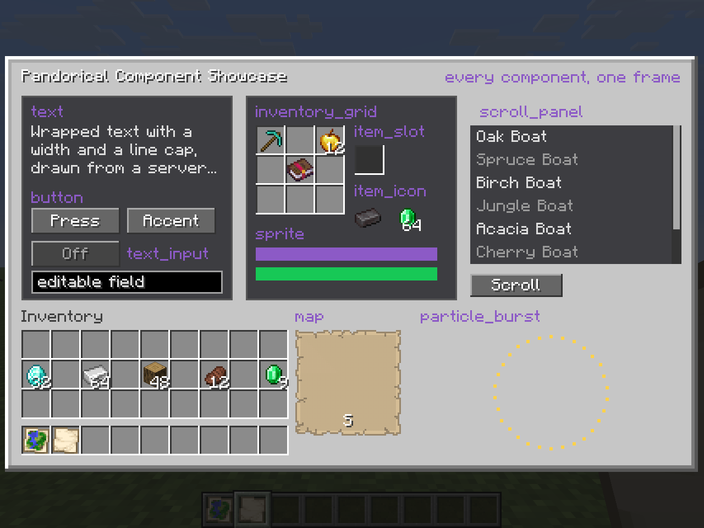

# Pandorical Development

Pandorical is a bridge, not a content mod. Your mod runs entirely server-side and
*describes* what it wants: a screen, an overlay, a block, a keybind. Pandorical carries
that description to the client and renders it. Your mod ships no client code, no client
entrypoint, and no mixins.

The bet is the inverse of the usual one. You require players to have Pandorical
installed, and in exchange you get real UI instead of whatever can be disguised as a
vanilla container.

Everything below is also demonstrated running, in one place:
[pandorical-demo](https://github.com/fatlard1993/pandorical-demo) puts every component
type in a single screen and every world capability in a single frame. Clone it beside
this repo and `./gradlew runClient` if you would rather read a working screen than a
description of one.

## Adding it as a dependency

Pandorical is not published to a Maven repository. Depend on it as a Gradle subproject
pointed at a checkout beside yours:

```groovy
// settings.gradle
include ':pandorical'
project(':pandorical').projectDir = new File(rootProject.projectDir, '../pandorical')
```

```groovy
// build.gradle
dependencies {
    implementation(project(':pandorical'))
}
```

```json
// fabric.mod.json
"depends": {
    "pandorical": ">=1.0.0"
}
```

This compiles against Pandorical's working tree rather than a pinned release, so an API
change surfaces as a compile error immediately. That is deliberate, and it is why there
is no published artifact to pin against.

Version targets live in `gradle.properties` (Minecraft, loader, Fabric API) and
`fabric.mod.json` (Java). Match them.

## Strings that fail silently

Three string shapes in this API look right and are not. Get any of them wrong and
nothing throws, nothing logs, and the feature is absent. That is why they come
before anything else.

**Capability strings are a fixed list.** Only these nine are ever sent in the handshake:

`screens` · `content` · `camera` · `hud` · `structures` · `entity_overlays` ·
`chest_overlays` · `keybinds` · `hud_elements`

`hasCapability(player, "blockTints")` returns false forever, because `blockTints` is an
API surface, not a capability. Player inventory slots, block tints, and built-in entity
renderers have no capability string and are not guarded that way.

**Chest overlay ids keep their atlas prefix.** `minecraft:christmas` is not a sprite;
`minecraft:entity/chest/christmas` is. The wrong one draws magenta and logs nothing. See
[Chest overlays](#chest-overlays).

**Screen types and screen IDs are different keys.** Handlers register against the
*screen type* you passed to the `ScreenBuilder` constructor. Updates and closes address
a *screen ID*, which is generated per screen instance:

```java
screens.onAction("mymod:hello", "ok", handler);        // screen TYPE
screens.update(player, screenId, updates);             // screen ID
screens.close(player, screenId);                       // screen ID
```

A handler does not receive the ID. Get it from the player:

```java
String screenId = PandoricalApi.getOpenScreenId(player.getUUID());
if (screenId == null) return;
```

## Guards and timing

```java
// Guards players on vanilla clients
if (!PandoricalApi.isAvailable(player)) return;

// Per-capability guard, for anything a client might lack
if (!PandoricalApi.hasCapability(player, "hud_elements")) return;
```

`isAvailable(player)` and `hasCapability(...)` return false until the client's capability
handshake completes, which lands shortly *after* the player's JOIN event, not before.
Do not push a screen or HUD straight from a JOIN handler. Defer it a tick or two, or
trigger off the player's own first action, or the push silently no-ops.

Content sync is tracked separately. Wait for it before opening anything that draws your
own blocks, items, or textures:

```java
if (PandoricalApi.isContentReady(player)) {
    screens.open(player, ...);
}
```

## Quick start

The whole path, from mod init to a screen a player can click:

```java
public class MyMod implements ModInitializer {
    private static final String SCREEN_TYPE = "mymod:hello";

    @Override
    public void onInitialize() {
        // Register handlers once, at init. They key on the screen TYPE.
        PandoricalApi.screens().onAction(SCREEN_TYPE, "ok", (player, data) -> {
            player.sendSystemMessage(Component.literal("Clicked."));

            String screenId = PandoricalApi.getOpenScreenId(player.getUUID());
            if (screenId != null) PandoricalApi.screens().close(player, screenId);
        });
    }

    public static void openHello(ServerPlayer player) {
        if (!PandoricalApi.isAvailable(player)) return;

        ScreenBuilder screen = new ScreenBuilder(SCREEN_TYPE)
            .size(176, 100)
            .title("Hello");

        screen.panel("bg", 0, 0, 176, 100, Map.of("border", "beveled"));
        screen.text("greeting", 8, 24, "Hello from the server.");
        screen.button("ok", 8, 60, 60, 20, Map.of("label", "OK"));

        PandoricalApi.screens().open(player, screen.build());
    }
}
```

Everything else in this document is a variation on that shape: build a description,
hand it to an API, register handlers for what comes back.

For the same thing at full size - every component type at once, with the code that
produced it - see [ShowcaseScreen.java](https://github.com/fatlard1993/pandorical-demo/blob/main/src/main/java/justfatlard/pandorical_demo/ShowcaseScreen.java)
in the demo.

## Component types



Screens and HUD overlays are composed from these component types:

`panel` · `scroll_panel` · `text` · `button` · `text_input` · `sprite` · `item_slot` ·
`item_icon` · `inventory_grid` · `map` · `radar` · `particle_burst` · `dial` · `pixel_canvas` ·
`player_face`

`ScreenBuilder` and `HudBuilder` carry shorthand for the ones used most. The rest,
`text_input` and `item_slot` among them, are built with `ComponentBuilder` and passed to
`component(...)`. There is no `.textInput(...)`; do not go looking for one.

## Screens

`ScreenBuilder` produces the `OpenScreenS2C` payload. It carries shorthand for the
common components, and `component(ComponentBuilder)` for anything needing nesting,
scale, or rotation.

```java
new ScreenBuilder(SCREEN_TYPE)
    .id("explicit-id")              // defaults to a fresh UUID per builder
    .size(280, 180)
    .title("Fletching Table")
    .pauseGame(false)
    .container(10, true);           // 10 server-backed slots + player inventory
```

Shorthand: `panel` · `scrollPanel` · `button` · `text` · `inventoryGrid` · `itemIcon` ·
`sprite`. Nested or animated components go through `ComponentBuilder`:

```java
screen.component(new ComponentBuilder("badge", "sprite")
    .bounds(10, 10, 16, 16)
    .scale(1.5f)
    .rotation(45f)
    .prop("texture", "mymod:textures/gui/badge.png")
    .child(new ComponentBuilder("label", "text").pos(2, 2).prop("text", "!")));
```

### Opening

```java
ScreenApi screens = PandoricalApi.screens();

screens.open(player, screen.build());

// Backed by a real server-side Container; slot 0 is read-only here
screens.openContainer(player, screen.build(), container, Set.of(0));
```

### Updating

Updates address components by ID inside an already-open screen. `ComponentUpdateBuilder`
builds them; the client interpolates geometry changes over the following ticks. A new position
is measured the way the component's own was when it was built, from its parent's corner or the
screen's, and a component that moves takes its children with it.

```java
String screenId = PandoricalApi.getOpenScreenId(player.getUUID());
if (screenId == null) return;

screens.update(player, screenId, List.of(
    new ComponentUpdateBuilder("greeting").prop("text", "Updated.").build(),
    new ComponentUpdateBuilder("badge").pos(20, 10).scale(2.0f).build()
));
```

Two props ride the same update path and are worth knowing by name. `visible`
(`ComponentType.PROP_VISIBLE`, any component) takes a component and its children out of
the screen entirely: not drawn, not clickable, not a navigator target. It is how a screen
swaps one set of controls for another in place - build both at open time, hide one, flip
them on a press - without reopening and losing whatever the player was carrying. A
`text_input` being revealed usually wants `focused` (`PROP_FOCUSED`) sent with it, so the
first keystroke lands without a click. `dim_slots` (`PROP_DIM_SLOTS`, `inventory_grid`)
names container slots to veil over their items, which is what a search result looks like:
the server names the slots that did not match and the rest of the grid is what is left lit.

```java
screens.update(player, screenId, List.of(
    new ComponentUpdateBuilder("sort").prop(ComponentType.PROP_VISIBLE, "false").build(),
    new ComponentUpdateBuilder("search_box")
        .prop(ComponentType.PROP_VISIBLE, "true")
        .prop(ComponentType.PROP_FOCUSED, "true").build(),
    new ComponentUpdateBuilder("chest").prop(ComponentType.PROP_DIM_SLOTS, "0,1,5").build()
));
```

A window resize rebuilds the screen from its definitions with every update since the open
replayed over them, so a swapped-in control stays swapped in. What a component keeps that
no prop holds - the text typed into a field, strokes painted ahead of the server - is handed
from the old component to its replacement through `PandoricalComponent#inherit`.

### Painting by hand

`pixel_canvas` is a grid of palette-coloured cells the player paints with the mouse: drag
to lay the current ink under a square brush, right-click to report the colour under the
pointer. The client paints the moment the hand moves and reports each stroke; the server
applies the same stroke to its own copy and acknowledges it. Both ends run one rule,
`PixelCanvas#apply`, over the same cells and the same supply of ink, so they agree without
the cells being sent back. Send `pixels` again only when your copy moved some way the client
could not have predicted: a stroke you refused, or a change from outside the canvas.

```java
screen.component(new ComponentBuilder("canvas", ComponentType.PIXEL_CANVAS)
    .bounds(8, 8, 192, 192)
    .prop(ComponentType.PROP_CANVAS_COLUMNS, "32")
    .prop(ComponentType.PROP_CANVAS_ROWS, "32")
    .prop(ComponentType.PROP_CANVAS_PALETTE, "#FFF7E9A3,#FF993333,#FF334CB2") // up to 256
    .prop(ComponentType.PROP_CANVAS_PIXELS, PixelCanvas.encode(cells))
    .prop(ComponentType.PROP_CANVAS_SUPPLY, PixelCanvas.encodeSupply(supply)) // omit for unlimited
    .prop(ComponentType.PROP_CANVAS_INK, "1")
    .prop(ComponentType.PROP_CANVAS_ACK, "0"));

screens.onAction(SCREEN_TYPE, "canvas", (player, data) -> {
    PixelCanvas.Stroke stroke = PixelCanvas.Stroke.fromAction(data);
    if (stroke == null) return; // a pick: data.get(PixelCanvas.ACTION_PICK)
    PixelCanvas.apply(cells, 32, 32, supply, stroke, changedIndex -> { /* redraw it */ });
    screens.update(player, screenId, List.of(new ComponentUpdateBuilder("canvas")
        .prop(ComponentType.PROP_CANVAS_ACK, String.valueOf(stroke.seq()))
        .prop(ComponentType.PROP_CANVAS_SUPPLY, PixelCanvas.encodeSupply(supply)).build()));
});
```

Cells are bytes, read unsigned, so a palette can have up to 256 colours; `PixelCanvas.encode` is their base64. The supply lists only the inks there is any of, as `index:amount` pairs.

A stroke carries the ink and brush the client saw while making it, so a colour chosen a
moment before the server heard about it still paints in that colour. Check them before
applying: they came from the client. mc-paint's easel is the working example.

### Handlers

All key on screen type, all registered once at init.

```java
screens.onAction(SCREEN_TYPE, "confirm-button", (player, data) -> { ... });

// Catch-all for generated IDs, e.g. "recipe_0", "recipe_1", ...
screens.onActionFallback(SCREEN_TYPE, (player, data) -> {
    String componentId = data.get(ScreenApi.FALLBACK_COMPONENT_ID_KEY);
});

screens.onClose(SCREEN_TYPE, player -> { ... });
screens.onSlotChange(SCREEN_TYPE, (player, slotIndex, stack) -> { ... });
screens.onContainerRemoved(SCREEN_TYPE, player -> { /* return items */ });
```

`onContainerRemoved` is where items get handed back. A container screen closed without
returning its contents strands them on the server.

## HUD

Shown working in [ShowcaseHud.java](https://github.com/fatlard1993/pandorical-demo/blob/main/src/main/java/justfatlard/pandorical_demo/ShowcaseHud.java), including suppressing a vanilla element and animating one by update.

```java
HudApi hud = PandoricalApi.hud();

HudBuilder overlay = new HudBuilder("mymod:unread")
    .anchor("bottom_center")
    .offset(-40, 60);

overlay.text("count", 0, 0, "3 unread");

hud.show(player, overlay.build());
hud.update(player, "mymod:unread", updates);
hud.hide(player, "mymod:unread");
```

Anchors: `top_left`, `top_right`, `bottom_left`, `bottom_right` (offset is a margin from
that corner), `center` (offset is a nudge from true screen center, for prompts that need
to sit near the crosshair), `bottom_center` (offsetX positions the overlay's left edge
relative to horizontal center, for sitting with the hotbar rows), `top_center` (the overlay's
own width is centred; hidden while the player list is open, since that is where it drops). See
the javadoc on `HudBuilder#anchor` for the full contract.

`particleBurst` draws lightweight local particle effects; `map` renders a map component.

### Standing in for vanilla elements

```java
hud.hideVanillaElements(player, "mymod", List.of(VanillaHudElement.FOOD_BAR));
hud.restoreVanillaElements(player, "mymod");
```

Suppression is keyed by the requesting mod, so two mods hiding different elements do not
clobber each other, and an element stays hidden while any of them still wants it hidden.
Chat, the player list, the sleep overlay and the demo timer are deliberately not
suppressible.

Clients lacking the `hud_elements` capability keep drawing vanilla's version. An overlay
meant to *replace* a vanilla element needs a layout that still works alongside it, or
should not be pushed to those clients at all.

## Content

A synced block's light is the server's: each state's emission travels with the block and
the client stand-in is built with it, so a torch on a slab glows on every client that has
Pandorical. Nothing to declare; the block's own `lightLevel` is what gets sent.

Register during `onInitialize`. Content syncs to clients in the configuration phase,
before Fabric's registry sync.

`content.solidRails()` makes every rail hold a player up: two pixels of deck on a flat one,
a ramp of steps on a slope, for players only, so carts and mobs are untouched. It rides the
content sync as a flag, and the same shape (`RailCollision`) is applied on both sides through
one mixin on `BaseRailBlock` plus the client's stand-in blocks, because a floor the client
cannot predict is one it keeps dropping the player through.

```java
ContentApi content = PandoricalApi.content();

content.registerBlock("mymod:my-block", new BlockRegistration(...));
content.registerItem("mymod:my-item", new ItemRegistration(...));
content.registerAsset("mymod/models/block/my-block.json", jsonBytes);
content.registerModAssets("mymod");   // auto-scans classpath assets/

// Repaint a vanilla item for Pandorical clients only
content.overrideVanillaItem("minecraft:rabbit_hide", new VanillaItemOverride(...));
```

`registerModAssets` is the usual call. Anything your mod draws (textures for entity
overlays, chest overlays, custom blocks) must be registered here or the client has
nothing to load.

## Camera

```java
CameraApi camera = PandoricalApi.camera();

camera.setDistance(player, 6.0f);
camera.setPerspective(player, "third_person_back");
camera.reset(player);
```

## Entity overlays

An extra texture layer on one specific living entity, for per-entity cosmetics. The
texture must follow that entity model's own texture layout; transparent pixels are not
drawn.

```java
PandoricalApi.entityOverlays().set(entity,
    Identifier.fromNamespaceAndPath("mymod", "textures/entity/my_overlay.png"));

PandoricalApi.entityOverlays().clear(entity);
```

Broadcast to every current and future tracker of the entity, so there is no player
argument. State is in-memory only and dropped when the entity unloads: re-call `set`
when your entity loads, from a tick hook reading your own persisted flag.

## Pictures

A grid of palette-coloured cells standing in the world as a thin panel, at any yaw, tilt and
size, anchored to an entity: a canvas on an easel, a board anything can be painted onto and seen
changing. Like entity overlays, a picture is broadcast off the anchor's tracking, so there is no
player argument and nobody out of range is sent anything.

```java
PandoricalApi.pictures().show(anchor, new Picture(columns, rows, paletteArgb, cells,
    new Picture.Pose(dx, dy, dz, yaw, tilt, widthBlocks, heightBlocks),
    backArgb, thicknessBlocks));
PandoricalApi.pictures().paint(anchor, changedIndices, newValues); // just what changed
PandoricalApi.pictures().clear(anchor);
```

The pose places the middle of the picture's bottom edge, offset from the anchor; yaw turns it the
way an entity's yaw does. The front is drawn unshaded, as vanilla draws a map in a frame, so a
colour looks the same whichever way the picture faces; the back and edges take `backArgb`, or are
left out when its alpha is nought. An invisible item display makes a good anchor: persistent,
tracked, and nothing to hit. State is in memory and dropped when the anchor unloads, so show it
again when your anchor loads. mc-paint's easel is the working example.

## Chest overlays

Draw particular chests with a different texture, so a player can tell (say) the ones a
village generated from their own.

```java
ChestOverlayApi chests = PandoricalApi.chestOverlays();

chests.replace(player, texture, positions);  // state the whole truth; the call for a join
chests.add(player, texture, positions);      // mark more, leave existing marks alone
chests.remove(player, positions);            // unmark, whatever texture they carried
```

Unlike entity overlays these are addressed to one player, because whether a chest
deserves marking can depend on who is looking.

The texture is a sprite **id** in the vanilla chests atlas, and it keeps the atlas's
directory prefix: `<yourmod>:entity/chest/<name>`, not the bare `<yourmod>:<name>`. A
bare name resolves to no sprite and the chest draws as missing-texture magenta, which is
the only symptom you get. No extension, and no `_left` / `_right` suffix: the client
appends those itself for each half of a double chest. Ship all three files
(`<name>.png`, `<name>_left.png`, `<name>_right.png`) under
`assets/<yourmod>/textures/entity/chest/`.

Nothing is persisted across a reconnect. Send the marks again on join.

## Context models

A block can be drawn differently for what stands beside it. The client swaps the model where
the chunk compiler looks it up, with the neighbours in hand; each case is a provider that names
the extra models it wants (found by scanning, so nothing is loaded that nobody shipped) and
picks one at render time. Three ship today.

**Rail diagonals.** A run of alternating curved rails is drawn as the straight diagonal it stands for. The
client swaps a curve's model for a chord when both of its connected neighbours are the
complementary curve; the chord models come from whichever mod ships the rail, named
`<block>_diagonal_<se|sw|nw|ne>` beside its block models (`<block>_on_diagonal_...` for a
powered state). A rail without them keeps its bend. Any block with a `shape` property of
`RailShape` is a rail here, so a server-defined stand-in qualifies as readily as vanilla's.
Minecart Mania ships chords for vanilla's four rails and its own.

**Joined fence gates.** A gate with the same gate beside it on its line takes a joined model,
named `<gate>[_wall][_open]_join_<left|right|both>_<facing>`, the facing baked in because a
model picked here has no blockstate rotation. More Doors ships them for every vanilla gate.

**Door jambs.** A door with a fence connecting on its left or right takes a model with a
post where the fence arm arrives and rails across to the panel, named
`<door>_<lower|upper>_<hinge>[_open]_jamb_<left|right|both>_<facing>`. More Doors ships them
for the wooden doors and iron.

## Keybinds

Server-declared rebindable keys. Your mod claims a slot from a fixed client-side pool and
ships zero client code. A keybind reports its press through `onPress`; a handler that needs
the other edge, a handbrake or anything held, overrides `onRelease` too.

```java
// At mod init, before players connect. Key codes are the game's own table, which is
// neither GLFW's nor ASCII's: KeybindApi.letter gives the code for a letter.
PandoricalApi.keybinds().register("mymod:action", KeybindApi.letter('G'), "Do The Thing",
    player -> doTheThing(player));
```

Two slots come pre-bound: slot 1 to G, slot 2 to B. Naming one of those keys claims that slot
if it is free; any other key gets an unbound slot, and `bindByDefault` puts the key on it once
per client. The display name appears in the client's controls
screen under category "Pandorical", and a rebind persists in `options.txt` like any other
key. Presses arrive on the server thread, validated and rate-limited.

The pool is fixed at 8 slots because the options system only accepts keybind registration
during client startup. Unclaimed slots are inert and send nothing.

## Navigable screens

A Pandorical screen builds its UI from server-sent component definitions rather than
vanilla widgets, so `Screen.children()` reports it as empty and anything navigating by
keyboard focus or a gamepad finds nothing to press. `NavigableScreen` (in the common API,
`justfatlard.pandorical.api`) is how a screen says where its interactive parts are:

```java
// PandoricalScreen already implements this; a component opts in by overriding
// isNavigable(), which should be true exactly when it handles mouseClicked.
List<NavigableScreen.NavRegion> regions = ((NavigableScreen) screen).navRegions();
```

Regions are geometry only, with no activate hook. A navigator moves the pointer onto one
and clicks it through the screen's ordinary mouse path, so vanilla slots, vanilla widgets
and Pandorical components are all driven by one mechanism and none of them need to know
what is doing the navigating. Regions are computed per call rather than cached, because
component geometry is mutable and interpolates for several ticks after a server update.

## Crafting stations

A screen that is a crafting bench can say so, and a recipe book will speak for it:

```java
new ScreenBuilder("my-mod:bench")
    .container(10, true)
    .recipeStation("my-mod:my_category")
```

The category is a registered `RecipeBookCategory` id. Your recipes must return a real
`RecipeDisplay` from `Recipe#display()` and carry that category from `recipeBookCategory()` -
without a display the client cannot see the recipe at all, and without the category a workbench's
book will offer it and then fail to craft it.

Pandorical draws nothing for this. It has no book of its own and no opinion about whose should
appear; it only answers "what is this screen for", through
`PandoricalContainerScreen#getRecipeStation()`, which is what a book needs before it can offer
anything. smart-recipe-book puts a button on any screen that declares one.

Browsing only. Filling a grid goes through `ServerboundPlaceRecipePacket`, which the server
answers for menus carrying a recipe book, and a Pandorical menu does not.

## Banner decals

`PandoricalApi.bannerDecals()` lays banner pattern layers flat on a block, per player and
per position, drawn by the client with vanilla's own pattern sprites through the banner's
flag model laid on its back. No base colour is drawn: the block's own texture is the ground,
which is what makes a patterned bed read as a bed. A decal is described from its anchor block
(`toHead`, `lift`, `fromHead`, `length`, `width`) and cleared by sending the position with no
layers. Clients skip a decal whose chunk is not loaded or whose block is gone. Vanilla clients
see nothing; a mod keeping an item display as their fallback marks the displayed item's custom
data with `BannerDecalApi.HIDDEN_ITEM_KEY` and Pandorical clients leave that display undrawn.

## Settings

Per-player settings a server mod would otherwise put behind a command, on the mod's own page of
the mod menu. A mod declares its settings once at init, under its own name; `/pandorical settings`
reaches the same values as text on a vanilla client.

```java
PandoricalApi.settings().group("block-tip", "Block Tip")
    .choice("mode", "Show tips", options, "always")
    .describe("Names what you are looking at")
    .backedBy(player -> ..., (player, value) -> ...);
```

A client-side mod, with no server half to declare anything, declares from the client instead:
`PandoricalClientApi.settings().group(...)` takes the same three kinds, each as a getter and a
setter over whatever the mod already keeps. The client tells the server what it has after the
hello, the mod appears in the same menu marked *this client*, and a change made there is handed
back to the client to apply. `changed()` tells the server the values moved some other way.

`serverGroup` declares a mod's **server settings**: one value for everyone, shown to ops alone
under their own heading on the mod's page, and refused to anyone else from the command too. They
are for what a mod would otherwise keep in a config file - rates, cooldowns, world-shaping
switches - and `backedBy` points each at the mod's own config with a setter that writes the file,
so the file stays the record. Unbacked ones are kept by Pandorical on the overworld.

A setting can say when it is shown: `shownWith("village-mail")` only while that mod is
installed, `shownWhen(other, value)` only while a setting declared before it has that value, or
`shownWhen(player -> ...)` for anything else. A setting not shown is not counted, not listed, and
refused from the command, and the page is laid out again when a change may have shown or hidden
one.

Four kinds of setting: a **toggle**, a **choice** among named options, a **number** with a
range and step, and a **list** of the player's own entries, each with a button that takes it
off - for what a mod collects by command or by play, where seeing the list and pruning it is
the whole ask. Each is read with `get(player)` and written with `set(player, value)`, and takes
`onChange` listeners. Values are kept per player by Pandorical, on the overworld, unless the
mod already keeps them, in which case `backedBy` makes the screen another way to reach the mod's
own store and the two can never disagree. A change from the screen re-labels the control in
place, and lays the page out again only when a setting may have appeared or gone.

## Documented in the javadoc, not here

`structures`, `playerInventory`, `blockTints`, and built-in entity renderers work the
same way, through `PandoricalApi`. Each carries a trap this page will not save you from:
structure IDs must be unique server-wide, structures must be despawned or they leak
state, tints must be registered before the client asks. One more for structures: anything
that has to be drawn on a moving structure must blend between positions by the structure's
own rule (`StructureInterpolationHandler`, over `StructureManager.INTERPOLATION_TICKS`),
because a vanilla blend sits a different distance behind the server and the gap is what a
rider sees. Server-only entity stubs and cushions already do; push their position every tick
(cushions need `needsSync`, vanilla never expects one to move). `BlockTintApi#positional` has a
trap of its own worth naming here, because nothing reports it: a tint only reaches model
faces carrying a `tintindex`, and most vanilla models carry none. And a tint multiplies, so
over a coloured texture half the palette disappears; drain the texture to grey and give
`positional(fallbackArgb, ...)` the colour every unpainted position should keep. Particles a
painted block throws from its animate tick wear the paint too, brightness kept. Painting a vanilla
block means also shipping a model override that adds one, through
`ContentApi#registerAsset` under the `minecraft` namespace - the synced pack sits at
`Pack.Position.TOP`, so it wins over vanilla's copy. Without that the colours arrive,
land nowhere, and the block stays exactly as it was. Read the javadoc on
`StructureApi`, `PlayerInventoryApi`, `BlockTintApi`, and
`PandoricalApi#registerEntityRenderer` before wiring them up.

`playerInventory` covers more than slots, and the rest is easy to miss looking for it:
`registerButton` puts a square glyph button on the vanilla inventory panel, `onButton`
answers a press, and `setButtonGlyph` changes what one player sees on one button - which
is how a button that is a switch says which way it is set. `registeredSlots` walks every
slot group, for the mods that have to empty the whole extra inventory rather than one
slot they already know the name of.
