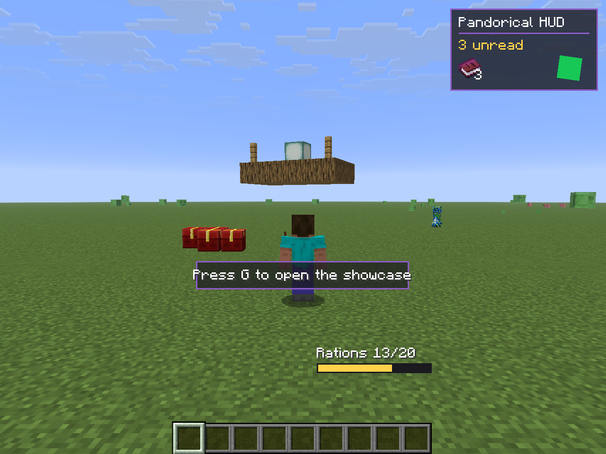

# Pandorical

Install this if a server asked you to. It lets that server draw screens, overlays and
blocks vanilla Minecraft has no way to show you.

Normally a modded server means every player installs every mod, matched version for
version. Pandorical replaces that with one install. The server keeps its mods, you keep
Pandorical. Its mods send the screens, overlays, blocks and keys; your client draws
them. Add a mod to the server and you see it next time you log in, with nothing to
download.

## What a server can show you

- **Real interfaces**, instead of everything pretending to be a chest. Quest dialogue,
  a mailbox, a trade window, a crafting station with its own layout.
- **HUD overlays** that sit alongside your hotbar or replace a vanilla bar outright, and
  update live.
- **Custom blocks and items** that arrive when you join, with no resource pack to install
  and no download prompt.
- **Rebindable keys** the server defines. They appear in your normal controls screen
  under "Pandorical", and rebind like any other key.
- **Moving structures**, like a ship built out of blocks that sails as one piece.
- **Camera control**, when a server wants to pull the view back.
- **Cosmetic overlays** on particular mobs or chests, so you can tell one from another.

None of this is Pandorical's own content: no items, no blocks, no recipes, nothing
added to a world. Everything you see through it comes from a mod on the server.

## Do I need it?

- **Playing on a server that uses it**: yes, and you will usually be told. Without it,
  a mod built on Pandorical either degrades quietly (an item shows a raw name instead of
  a proper one) or refuses outright, telling you in chat that Pandorical is required.
- **Playing on a vanilla or unrelated server**: it does nothing. The handshake never
  happens and nothing draws. The one trace it leaves is eight rebindable "Pandorical
  Action" rows in your controls screen, which sit there unused until a server names them.
- **Running a server**: install it on the server too, alongside whichever mods depend on
  it. It is the one mod in this suite that belongs on both sides.

## Installation

Fabric, plus Fabric API. Drop the jar in `mods/` on the client, and in `mods/` on the
server if you run one.

Everything above the grass in that shot comes from the server: the corner panel and the
prompt, the ration bar standing where the hunger bar would be, the marked chests, and the
raft floating as one piece. The client installed one mod.

## Mods that use it

Around thirty server-side mods are built on Pandorical, all at
[github.com/justfatlard](https://github.com/justfatlard). The ones where you will see
it most:

- [village-mail](https://github.com/justfatlard/village-mail): a postal system with a
  full mailbox interface and an unread-mail badge
- [village-quests](https://github.com/justfatlard/village-quests): villager dialogue and
  quest screens
- [player-trade](https://github.com/justfatlard/player-trade): player-to-player trading
  windows
- [fletch-craft](https://github.com/justfatlard/fletch-craft): a working fletching table
  with its own crafting layout

## For mod developers

Your mod stays server-side and describes what it wants drawn. Pandorical does the rest,
so you ship no client code.

See [DEVELOPMENT.md](DEVELOPMENT.md) for the API, the capability handshake, and the two
string mistakes that fail silently.

For a worked example, [pandorical-demo](https://github.com/fatlard1993/pandorical-demo)
puts every component type in one screen and every world capability in one frame, and it
is where the screenshots on this page come from.

## License

MIT, see [LICENSE](LICENSE).
